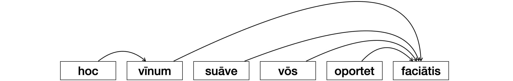
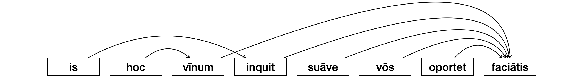

# Ranks
The motivation for adding ranks to dependencies.

In the context of teaching Latin, wordings are represented as dependency structures for three end purposes:

* for students to view and learn the dependencies between words
* for automatically generating exercises on grammatical phenomena
* for assessing whether a clause can be understood given what was taught

Ranks will improve the usability of dependency trees for all these purposes, but here I shall focus on how they improve graphical representation of grammatical units and how this can improve comprehension.

## The clause

The first grammatical unit one has to master in a historical language is an affirmative clause representing a present process. One example of such a clause in Latin is *hoc vīnum suāve est* (*this wine is smooth*). Variants of this clause include *hoc vīnum suāve fit* (*this wine feels smooth*) and *hoc vīnum suāve ego faciō* (*this wine feels smooth to me*). Variants of the last include *an hoc vīnum suāve vōs facitis* (*does this wine feel smooth to you*) and *hoc vīnum suāve vōs oportet faciātis* (*notice how smooth this wine feels*). Here we see that we can create variants in English with similar grammatical structures only up to a certain point. From that point on we need two clauses in English (*notice* + *how smooth this wine feels*) for one in Latin (*hoc vīnum suāve vōs oportet faciātis*).

Languages differ in the amount of variation they offer for the rank of clauses and they differ in the words where this variation lies. Do we add operators like *an* or verbs like *does* to make an imperative clause become interrogative? Do we switch between two verbs like from *fit* to *faciō* to specify the person for whom something carries an attribute, or do we keep the verb *feels* and add an adjunct like *to me*? These are options we have within a given language and they are not universal.

To understand which options one has at clause rank, students have to learn 'what goes instead of what' in a clause and this paradigmatic principle should be what guides what is a clause constituent. However, in dependency structure an argument such as *hoc vīnum* (*this wine*) depends on the process verb *faciātis* in the same way as the auxiliary verb *oportet*. This results in graphical representations like the following.

A better way for a learner to visualize this clause would be to separate the ranks at which dependencies occur. For instance, *hoc* depends on *vīnum* at the group rank. In the same way, *oportet* depends on *faciātis* at group rank. All other dependencies take place at clause rank. If dependencies are tagged for ranks, we are able to represent grammatical units at different ranks. At clause rank, we would have the following structure:

| hoc vīnum        | suāve            | vōs              | oportet faciātis |
|:----------------:|:----------------:|:----------------:|:----------------:| 
| Tail             | Tail             | Tail             | Head             | 

In turn, at the group rank we would have two structures:

| hoc              | vīnum            |
|:----------------:|:----------------:| 
| Tail             | Head             |

| oportet          | faciātis         |
|:----------------:|:----------------:| 
| Tail             | Head             |

Of course, since we are the ones who create the linguistic descriptions, we can ascribe different labels to each tail constituent of a grammatical unit: this would include labels such as Subject, Object, Carrier, Attribute, Attributor, and the like. Moreover, we can still represent clauses in the original graphical representation with arrows as shown above. There is no information loss when we add ranks to dependencies. The only thing that changes is that we become able to show different sets of dependencies at different times, thus letting students focus on different grammatical phenomena in each graphical representation.

## The clause complex

Though a student of historical languages starts at the clause, they cannot end their journey there. They must learn how to understand connected clauses in a text. Above the clause, we have clause relations of different types. Some clauses elaborate others, representing the same in another way. Other clauses extend the previous, listing what else is the case. Finally, another set of clauses enhance the previous temporally, causally, or conditionally. Together, these relations are known as expansions. From a different perspective, we have relations of projection whereby a mental or verbal process represented by a clause reflects the process represented by the other clause. For instance, the clause complex *is, hoc vīnum, inquit, vōs oportet suāve faciātis* (*he said, notice how smooth this wine is*) is composed of two clauses. The first clause *is inquit* (*he said*) represents a verbal process whereas the second clause *hoc vīnum vōs oportet suāve faciātis* (*notice how smooth this wine is*) represents a relational process between the wine its smoothness for someone: the second clause is also a projection of the verbal process in the previous one. Projections and expansions are the two types of clause relation.

In dependency structure, clause relations can be represented as relations between process verbs. Here is a graphical representation of this clause complex with arrows.

In such cases, if we separate the clause rank from the clause complex rank, we are able to represent clauses as constituents of logical relations as shown below:

| is,     | hoc vīnum, | inquit, | vōs oportet suāve faciātis |
|:-------:|:----------:|:-------:|:--------------------------:|
| Head... | Tail...    | ...Head | ...Tail                    |

Such graphical representations where clauses are constituents are much simpler to understand than arrows relating different verbs in two structures. By viewing only the dependencies that take place at clause complex rank, students would be better able to focus on the logical relations between clauses than they currently can in the arrow representation.

  
