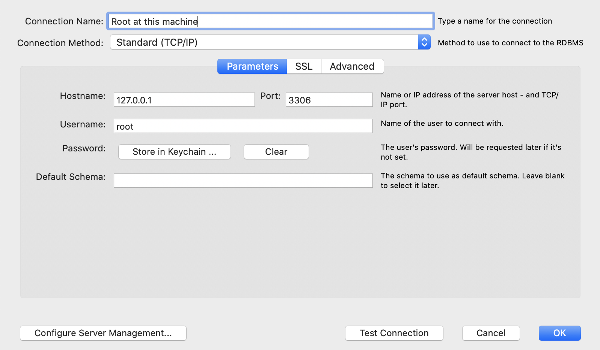
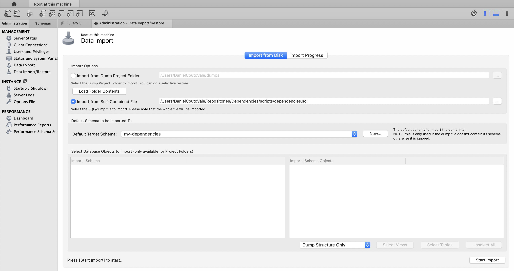

# Dependencies
A library for ranked universal dependencies.

For an introduction to ranks, see [the motivation for ranks](RANKS.md).

For an introduction to IP, see [the motivation for IP](IP.md).

This library includes scripts to load linguistic descriptions in UD and 
SYS files and analyzed texts in CONLLU files into a MySQL base. It also
includes scripts to translate a text analysis from a linguistic description
into another and to check whether a text analysis is complete.

## Overview

In the scripts directory, you will find 1 SQL script:

- dependencies.sql

And a sample PROPERTIES file:

- database.properties

And you will find 6 JAR scripts:

- import-ud-file.jar
- import-sys-file.jar
- import-conllu-file.jar
- export-conllu-file.jar
- translate-analysis.jar
- check-analysis.jar

In the following, you will learn how to create a database with the `dependencies` schema,
how to use the scripts to import linguistic descriptions, text analyses, how to translate
text analyses from a description to another and how to verify if an analysis is complete.

## Dependency Base

A `dependency base` is a MySQL base with the `dependencies` schema provided in the `dependencies.sql` file.
You can store multiple dependency bases in the same machine as long as you give each one of them a different
name. In this section, we will call our dependency base `my-dependencies` for simplicity.

First you must install a service and an application in your machine.

- Install MySQL Service
- Install MySQL Workbench 

When installing MySQL Service, you will be asked to provide a password. Keep that password. You will need it. Once you install MySQL Service and activate it, you will have turned your machine into a MySQL Server. Now you can create MySQL bases in it where you can store actual data.

To create a dependency base, open the application MySQL Workbench and create a connection between the application and the MySQL server. Give it a name such as 'Root at this machine'. The MySQL server (the host of the MySQL Service) is your machine itself. For this reason, you can refer to it by the IP number `127.0.0.1`. The `port` is the number of the service running on your machine. MySQL has number `3306` unless you manually specify another number for it. When you installed MySQL Service, a user named `root` was automatically created so you can identify yourself as `root` and you should provide the password you created here. Test your connection by clicking the 'Test Connection' button. If it is working, click the 'Ok' button to create the connection and click on the connection panel to open it. 



Once you open a connection with a MySQL Server, you can import data. Specify that you want to import data from a Self-Contained File and specify the path to the `dependencies.sql` file in your machine. Click on the 'New' button to create a new MySQL base with the name you specify. We chose the name `my-dependencies` for our MySQL base. Select `Dump Structure Only` at the option menu. And click on the 'Start Import' button. This will import the `dependencies` schema into your newly created MySQL base.



Now you have to re-write the database.properties file. Make sure you specify the MySQL base name, the user name, and the password properly. Here is an example of the content:

```properties
DependencyBase.name=my-dependencies
DependencyBase.user=root
DependencyBase.password=123456789
```

Finally, you will have to download the MySQL driver for JAVA, a JAR file that needs to be in the scripts folder for the scripts to work.  I myself tested the scripts with the `mysql-connector-java-5.1.49.jar` file. Both this and newer versions should work fine.

## Linguistic Descriptions

A `linguistic description` is a description of the options a writer has for making meaning in a language. In the end, a linguistic description is a description of human language as a system of options.

A UD file contains a linguistic description in a linguistic theory that foregrounds the dependencies between words. In contrast, a SYS file contains a linguistic description in a linguistic theory that foregrounds the dependencies between systems of options. The latter is more general than the former. For instance, PERSON is a system of options that applies to verbs, but not all verbs. In a UD file, one can specify that 'verb' is a WORD-CLASS and that verbs *can* have a feature for PERSON. In a SYS file, one can specify that 'verb' is a WORD-CLASS, that 'personal-verb' is a VERB-CLASS and that personal verbs *must* have a feature for PERSON. In turn, this enables an analysis checker to state whether an analysis is complete or not. For instance, if a personal verb does not have a feature for PERSON in a particular analysis, the analysis is incomplete. In contrast, the linguistic description contained in a UD file only allows an analysis checker to tell whether the analysis is compliant or not, not whether it is complete or not.

To add a linguistic description in a UD file to a dependency base, one has to run the script `import-ud-file.jar` in the command line. You need to specify the name you want to have for the description in your dependency base and the file path. The code was tested with the `stats.xml` file from the GIT repository `UD_Latin-ITTB`.

```
java -jar import-ud-file.jar [description] [file] 
```

A similar procedure applies for adding a linguistic description in a SYS file to a dependency base. Howver, one has to use the script `import-sys-file.jar` instead. A sample SYS file is provided in this repository. It is called `ip.sys`.

```
java -jar import-sys-file.jar [description] [file] 
```

To add a text and a text analysis in a CONLLU file to a dependency base, you will need to run the script `import-conllu-file.jar`. You will have to inform:

* the corpus name or a name for a new corpus
* the language name or a name for a new language
* a title for the text to add to the specified corpus-language pair
* the description name
* a name for the analysis to add to the specified description
* the path to the CONLLU file

The code was tested with the file `la_ittb-ud-dev.conllu` from the GIT repository `UD_Latin-ITTB`.

```
java -jar import-conllu-file.jar [corpus] [language] [text] [description] [analysis] [file]
```

Once an analysis is imported, it can be export ported back as a CONLLU file with the following command.

```
java -jar export-conllu-file.jar [corpus] [language] [text] [description] [analysis] [file]
```

A text analysis in a dependency base can be translated and checked for completion as we shall see next.

## Text Analyses

A text analysis can be translated from a linguistic description to another. A way of translating text analyses is specified in a DUX file. A sample DUX file is provided in this repository. It is called `ittb-ip.dux` and it translates a text analysis from the `ittb` description in the file `stats.xml` from the repository `UD_Latin-ITTB` to the `ip` description in the file `ip.sys` from this repository. The functions are not yet translated (coming soon).

To translate a text analysis from a source description to a target description, one needs to run the script `translate-analysis.jar`, informing:

* the source description name
* the source analysis name
* the target description name
* a name for the target analysis
* the path to the DUX file

```
java -jar translate-analysis.jar [source-description] [source-analysis] [target-description] [target-analysis] [file]
```

Once translation is made, one can check a linguistic description for completion. This is achieved by running the script `check-analysis.jar`. Here one needs to specify:

* the description name
* the analysis name
* the corpus name
* the language name
* the text title

```
java -jar check-analysis.jar [description] [analysis] [corpus] [language] [text]
```

When an analysis check is run, every word that is incomplete is printed out together with information about which features are missing.
